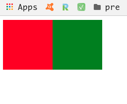
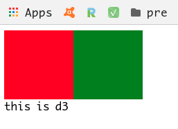
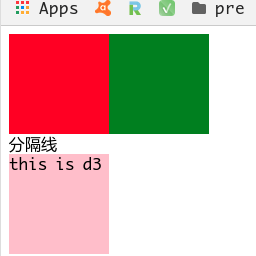
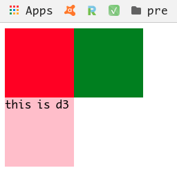

# css.md
Wednesday, January 23rd 2019, 15:35


<!-- @import "[TOC]" {cmd="toc" depthFrom=1 depthTo=6 orderedList=false} -->
<!-- code_chunk_output -->

* [css.md](#cssmd)
* [Cascading Style Sheets](#cascading-style-sheets)
	* [Inline CSS](#inline-css)
	* [Embedded/Internal CSS](#embeddedinternal-css)
	* [External CSS](#external-css)
	* [use @import](#use-import)
* [Syntax](#syntax)
	* [basic selectors](#basic-selectors)
		* [type selector](#type-selector)
		* [id selector](#id-selector)
		* [class selector](#class-selector)
	* [property selector](#property-selector)
	* [伪元素选择器](#伪元素选择器)
	* [descendant selectors 层级选择器](#descendant-selectors-层级选择器)
* [inheritance](#inheritance)
* [properties](#properties)
	* [font related properties](#font-related-properties)
	* [text related properties](#text-related-properties)
	* [background related properties](#background-related-properties)
	* [list related properties](#list-related-properties)
	* [size related properties](#size-related-properties)
	* [display related properties](#display-related-properties)
	* [float properties](#float-properties)
* [盒子模型](#盒子模型)

<!-- /code_chunk_output -->


# Cascading Style Sheets

**Cascading** refers to the way CSS applies style on top of another

**Style Sheets** control the look and feel of web documents

**HTML** sorts out the page structure

**CSS** defines how HTML elements are displayed

**CSS** code can stay with HTML code(*inline*, *embedded*) and be stored in a separate file(*external*, recommended way)

there are three sources responsible for the styles we see on the web page: 1. the style sheets created by the author of the page 2. the user customized styles, if any 3. the default styles of the browser itself

## Inline CSS

write in HTML tags and just work in that tag

```html
<p style="color: green">"style='color: green'" is a inline styling css</p>
```

## Embedded/Internal CSS

write in `<style>` tag, inside the `<head>` section of a html page

```html
<head>
    ...
    <style>
        div {
            color: pink;
            background-color: green;
        }
    </style>
</head>
<body>
    <div>this div is applied the style</div>
    <div>this div is also applied the style</div>
</body>
```

## External CSS

write in a separate file and then referenced in the HTML file using `<link rel="stylesheet" type="text/css" href="path_to_css.css">`

## use @import

a way that combines Embedded and External CSS, **this way is not compatible with old versioned IE, and the style is loaded after html loading and not support the dynamic style change by js**

# Syntax

consist of **selector**, **property** and **value**

usage:

```css
selector {
    property: value;
    ...
}
```

**selector** points to the html tag you want to style.

property and its value is separated by a colon.

one or more properties are separated by semicolons.

## basic selectors

### type selector

```css
html-tag {
    property: value;
    ...
    }
```

this is coarse-grained selector that **all** the corresponding tag will be applied to the style

coarse-grained 粗粒度的 `antonym`: :point_right: fine-grained 细粒度的

example:

```html
<style>
    span {
        color: red;
        font-size: 100px;
    }
</style>

<span>the font's color is red, and the size is 100px</span>
```

### id selector

```css
#id {
    property: value;
    ...
}
```

works in **all** tags whose `id` is the defined one, and the `id` can only be applied once per page

start with a `hash tag`, followed by the name of the id

example:

```html
<style type="text/css">
    #div1 {
        background-color: pink;
    }
</style>

<span id="div1">this span tag's background color is pink</span>
<div id="div1">this div tag's background color is also pink</div>
```

### class selector

```css
.class_name {
    property: value;
    ...
}
```

works in **all** tags whose `class`'s value is the same as defined one

start with a `period character`, followed by the name of the class

example:

```html
<style>
    .color-yellowgreen {
        background-color: yellowgreen;
    }
</style>

<span class="color-yellowgreen">the background color is yellowgreen</span>
<div>yellowgreen background</div>
```

the priority of these 3 selectors is: id > class > type

**Do NOT start a class or id name with a number!**

## property selector

```css
<style>
    basic selector[property="value"] {
        background-color: yellowgreen;
        ...
    }
</style>
```

based on [basic selectors](#basic-selectors), and dive into the html elements specified by the `basic selector`, style the corresponding elements with the same property value.

example:

```html
<style>
	input[type="text"] {
		background-color: pink;
	}
	input[type="password"] {
		background-color: green;
	}
</style>

<form action="">
	username: <input type="text" /> <br/>
	password: <input type="password" /> <br/>
</form>
```

the username form will be pink while the password form will be green

## 伪元素选择器

a标签的伪元素选择器

```css
<style>
	a:link{property: value;} /* link: 链接的初始状态 */
	a:hover{property: value;} /* hover: 鼠标悬浮时的状态 */
	a:active{property: value;} /* active: 点击时的状态 */
	a:visited{property: value;} /* visited: 动作完成时的状态 */
</style>
```

example:

```html
<style>
	a:link{color: blue;} /* link: 链接的初始为蓝色 */
	a:hover{color: red;} /* hover: 鼠标悬浮在链接上时为红色 */
	a:active{color: yellow;} /* active: 点击时为黄色 */
	a:visited{color: green;} /* visited: 动作完成时为绿色 */
</style>

<a href="#">click to see variant</a>
```

## descendant selectors 层级选择器

These selectors are used to select elements that are descendants of another element. When selecting levels, you can select as many levels deep as you need to.

```css
<style>
	父级选择器 子级选择器 ... {
		property: value;
		...
	}
</style>
```

选择器之间使用空格隔开

example:

to select the third span element

```html
<style>
	#d2 .dd1 span {
		color: pink;
	}
</style>

<div id="d1">
	<div class="dd1">
		<span>span1-1</span>
	</div>
	<div class="dd2">
		<span>span1-2</span>
	</div>
</div>
<div id="d2">
	<div class="dd1">
		<span>span1-1</span>
	</div>
	<div class="dd2">
		<span>span1-2</span>
	</div>
</div>
```

# inheritance

Inheritance refers to the way properties flow through the page. Achild element will usually take on the characteristics of the parent element unless otherwise defined.

# properties

## font related properties

`font-size`: defines fonts' size

`font-family`: defines type of font

## text related properties

`color`: name_of_color

`text-decoration`: none | underline

a link on the web page often has a describe text with underline, just like this: __a link__, if want to remove it, just set `text-decoration: none`

`text-align`: left | center | right

## background related properties

`background-color`

`background-image`: url("path_to_image")

`background-repeat`: 平铺方式

* `repeat`: 横向, 纵向平铺
* `no-repeat`: none
* `repeat-y`: vertical
* `repeat-x`: horizontal

example:

```html
body{
	background-color: black;
	background-image: url("images/dog.gif");
	background-repeat: repeat-y;
}
```

## list related properties

`list-style-type`: 列表项前面的标志, 圆点,方块...

`list-style-image`: url("path_to_image") 列表项前的小图片

example:

```html
<style type="text/css">
	ul{list-style-type: decimal-leading-zero;} 01,02...
	ul{list-style-image: url("images/forward.gif");} pic
</style>
```

## size related properties

`width`: width

`height`: height

## display related properties

`display`: none | block | inline
* none: hide
* block: 块级显示
* inline: 行级显示

example:

```html
<script>
	document.getElementById("username").onblur = function() {
		document.getElementById("username_tips").style.display = "inline";
	};
</script>

<style>
	form span {
		color: red;
		display: none;
	}
</style>

<form action="">
	username: <input type="text" id="username" /> <span id="username_tips">username is required!</span> <br/>
	password: <input type="password" id="password" /> <br/>
	<input type="button" id="btn" value="submit" />
</form>
```

上面的代码会在username输入框失去焦点时将span的display设置为inline, `username is required!` 就会显示到输入框后面, 如果`display="block"`, 则显示到输入框下面

## float properties

`float`: left | right 浮动是相对于父级元素的

`clear`: left | rigth | both 清除浮动, 浮动可能会导致相邻或父级元素不能正常显示, 因此需要使用`clear`

example:

```html
<style>
    #d1{width: 100px;height: 100px;background-color: red;float: left;}
    #d2{width: 100px;height: 100px;background-color: green;float: left;}
</style>

<div id="d1"></div>
<div id="d2"></div>
```

这里的父级元素是`<body>`, `float="left"`, 因此会在页面的左边, 如果为right则在页面右边, d1 d2会并列显示:



```html
<style>
    #d1{width: 100px;height: 100px;background-color: red;float: left;}
    #d2{width: 100px;height: 100px;background-color: green;float: left;}
    #d3{width: 100px;height: 100px;background-color: pink}
</style>

<div id="d1"></div>
<div id="d2"></div>
<div id="d3">this is d3</div>
```

d3不会显示, 这就是浮动属性的缺点



这时就需要使用`clear`来清除样式, 相当于在页面上划了一条分隔线, 分隔线以上的样式不会影响分隔线下方

```html
<style>
    #d1 {width: 100px;height: 100px;background-color: red;float: left;}
    #d2 {width: 100px;height: 100px;background-color: green;float: left;}
    #d3 {width: 100px;height: 100px;background-color: pink}
	#clear {clear: both}
</style>

<div id="d1"></div>
<div id="d2"></div>
<div id="clear">分隔线</div>
<div id="d3">this is d3</div>
```

实际开发中使用空div:




# 盒子模型

`border`: 多个属性的简写, 多个属性值以空格分隔

1. `border-width`: 边框的宽度
2. `border-color`: 边框的颜色
3. `border-style`: 边框的线型

还可以单独为每个边设置:

1. `border-top`
2. `border-bottom`
3. `border-left`
4. `border-right`

`padding`: 边框内壁与内部元素之间的距离

1. `padding: 10px;`: 上右下左都是10px
2. `padding: 1px 2px;`: 上下1 左右2
3. `padding: 1px 2px 3px;` 上1 左右2 下3
4. `padding: 1px 2px 3px 4px;`:上右下左依次是1 2 3 4, clockwise
5. `padding-top`...

`margin`: 边框外壁与外部元素之间的距离 属性设置同`padding`
