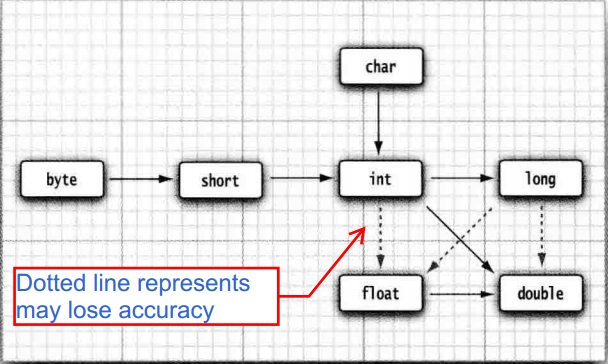

# Java基础.md
Monday, July 16th 2018, 21:10

## 数据类型
| &nbsp; | 类型 | 占用空间 | 取值范围 |
| :---: | :---: | :---: | :---: |
| 整型 | byte | 1 byte | -2<sup>7</sup> ~ 2<sup>7</sup>-1 |
| ^ | short | 2 bytes | -2<sup>15</sup> ~ 2<sup>15</sup>-1 |
| ^ | int | 4 bytes | -2<sup>31</sup> ~ 2<sup>31</sup>-1 |
| ^ | long | 8 bytes | -2<sup>63</sup> ~ 2<sup>63</sup>-1 |
| 浮点类型 | float | 4 bytes | 大约 ± 3.402 823 47E+38F (有效位数为 6 ~ 7 位）[<sup>[1]</sup>](https://blog.csdn.net/a327369238/article/details/52354811) |
| ^ | double | 8 bytes | 大约 ± 1.797 693 134 862 315 70E+308 (有效位数为 15 位) |
| char类型 | char | 2 bytes | 0 ~ 2<sup>16</sup>-1 |
| Boolean | boolean | 1 byte | true \| false |

***
## 自动类型提升
```java {.line-numbers}
byte b = 1;
int x = b + 1; //correct, byte + int --> int + int ==> x(int)
System.out.println(x);//2

byte b = 1;
byte c = 2;
//byte x = b + 1; // wrong, byte + int --> int + int ==> x(byte)
byte x = 1 + 2; // correct
byte x = b + c; // wrong, byte + byte --> int + int ==> x(byte)
System.out.println(x);//error: incompatible types: possible lossy conversion from int to byte
```
但是为什么直接赋值`byte b = 1`以及`byte x = 1 + 2`又是正确的呢?<br/>
`1`和`2`都是 ***常量*** , 在做上述运算时, 编译器会做范围检查(byte是-128 ~ 127), 满足就赋值, 否则`error: incompatible types: possible lossy conversion from int to byte`; 同样的, 在做`byte x = b + 1`运算时, 由于其中有变量`b`参与了运算,编译器不能确定`b + 1`的值(因为其可能发生越界:`b = 127`的情况), 因此不能完成赋值, 编译不通过. 而由于编译器会对`+=`做特殊处理`x += 1 --> (int)(x + 1)`, 不会出现上述情况.
当有**变量**在进行二元操作时, 如果两个操作数的类型不一致则要**先转换为同一类型**, 再进行运算.
> 如果两个操作数中有一个是double类型, 另一个操作数就会转换为double类型.<br/>
> 否则, 如果其中一个操作数是float类型, 另一个操作数就会转换为float类型.<br/>
> 否则, 如果其中一个操作数是long类型, 另一个操作数就会转换为long类型.<br/>
> 否则, 两个操作数都将被转换为int类型.<sup>Java核心技术卷I P41</sup>
<br/>
**被final修饰的变量不会自动提升类型, 不属于以上情况**
***

## 位运算
| 运算符 |    运算    | 示例 |
|:------:|:----------:| :----: |
|   <<   |    左移    |  3 << 2 = 12  |
|   >>   |    右移(高位补0)    |  3 >> 2 = 0    |
|  >>>   | 无符号右移 |   6 >>> 1 = 3   |
|   &    |   与运算   |   6 & 3 = 2   |
|   \|   |   或运算   |   6 \| 3 = 7  |
|   ^    |  异或运算  |   6 ^ 3 = 5  |
|   ~    |    取反    |    ~6 = -7  |

```java
int a = 3;
int b = a << 2; // b = 12;
```
<mark>
a << n --> a = a * 2<sup>n</sup><br/>
a >> n --> a = a / 2<sup>n</sup><br/>
位运算比常用的乘除效率更高
</mark>

交换两数的三种方式:
```java
//第一种, 使用第三个变量
temp = a;
a = b;
b = temp;

//第二种, 使用+-x/(可能溢出)
a = a + b;
b = a - b; // (a + b) - b ==> a
a = a - b; // (a + b) - ((a + b) - b) ==> b

//第三种, 使用异或
a = a ^ b;
b = a ^ b; // (a ^ b) ^ b ==> a
a = a ^ b; // (a ^ b) ^ ((a ^ b) ^ b) ==> b
```
使用`&`运算实现进制转换, 代码见:[RadixConversion.java](src/RadixConversion.java)<br/>
