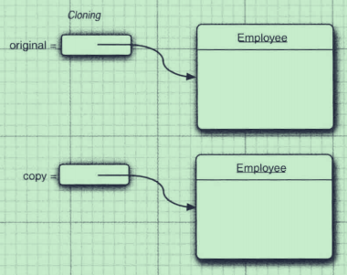

# Object_Oriented.md
Friday, July 20th 2018, 23:12

## 方法重载与方法重写
方法重载是编译时多态(前绑定), 方法重写是运行时多态(后绑定).
> 编译器通过用各个方法给出的参数类型与特定方法调用所使用的值类型进行匹配来挑选出相应的方法. 如果编译器找不到匹配的参数, 就会产生编译时错误, 因为根本不存在匹配, 或者没有一个比其他的更好.(没有一个更相符的匹配)<br/>
> Java 允许重载任何方法， 而不只是构造器方法。因此，要完整地描述一个方法，需要指出方法名以及参数类型。这叫做方法的签名（signature)。 例如， String 类有 4 个称为 indexOf 的公有方法。它们的签名是<br/>
> indexOf(int)<br/>
> indexOf(int, int)<br/>
> indexOf(String)<br/>
> indexOf(String, int)<br/>
> 返回类型不是方法签名的一部分。也就是说，不能有两个名字相同、参数类型也相同却返回不同类型值的方法。<sup>Java核心技术卷I P123</sup><br/>


当父类有多个构造时, 须显示声明默认构造;<br/>
当有继承关系时; 子类需能够访问到父类的无参构造(即不能没有或者使用`private`修饰)<br/>

接口是完全抽象的, 不能有具体实现. 接口中的方法**默认**是抽象方法, (由于abstract和static不能共存), 接口不能有静态方法(jdk8以后可以有静态方法和其具体实现), 不能有成员变量, 可以有常量和默认方法(显式使用`default`声明). 接口的定义模板:
```java
public interface InterfaceDemo {
    public static final int i = 1; // 任何时候常量都要先初始化

    public String getString();
}
```
接口中的所有常量为**静态常量**, 用`public static final`修饰, 可省略;
接口中的所有方法为**公有抽象方法**, 用`public abstract`修饰, 可省略不写; 但在实现接口时, 必须显式地给出`public`, 否则编译器会认为是默认修饰符<br/>

因为java是**单继承, 多实现**的, 因此接口的意义就在于存放公共的属性, 需要时可以多实现, 而由于继承是单继承的, 因此抽象类在这样的情形下, 不如接口方便. <br/>


## 反射

```java
Class类:
获取Class对象的3种方式:
Class c1 = Object.class;
Class c2 = obj.getClass();
Class c3 = Class.forName("java.lang.Object");// 处理ClassNotFoundException

getFields(), getMethods()将自身和父类的使用public修饰的域/方法装入数组返回
getConstructors()将自身public修饰的构造装入数组返回
getDeclaredFields(), getDeclaredConstructors(), getDeclaredMethods()返回自身所有域/构造/方法数组 不包括父类

Class, Field, Constructor, Method类:
getName()//获取名称
getModifiers()//获取修饰符的16进制整数表示, 使用Modifier.toString(class.getModifiers())转成字符串
getType()//获取数据类型的class对象
getReturnType()//返回Method类对象的返回值类型的class对象
getParameterTypes()//返回参数列表类型的class对象数组
```
以上方法的综合应用:[获取类的成员变量, 构造, 成员方法等信息](src/ObtainClassInfo.java)<sup>参考Java核心技术卷1 p195</sup>

```java
Student stu = new Student();
stu.setName("vauke");

Class stuClass = stu.getClass(); // 获取Student类class对象
Field f = stuClass.getDeclaredField("name"); // 获取Class对象中的名称为 name 的域的Field对象
String stuName = (String) f.get(stu); // 获取stu对象的域 name 的值
f.set(stu, "hyc");// 设置新值
```
如果name是private修饰的, `f.get(...)`不能获取其值, 抛出`IllegalAccessException`, 可使用`f.setAccessible(true);`解决


## Clone
由于java中都是值传递, 对于基本类型或不可变对象(String, 包装类等), 变量的赋值更改并不会对原来的变量产生影响; 对于引用类型, 引用的赋值是地址值, 两个引用指向同一片内存空间, 一旦修改其中的内容, 则另一个也将受到影响.
```java
int i = 1;
int copy = i;
copy++; // i不会因为copy的改变而改变, copy也是

Student stu = new Student();
Student stuCopy = stu; // 现在stu和stuCopy指向同一片内存
stu.setName("vauke");
stuCopy.getName(); // vauke
```
Object类提供的`clone()`, 克隆对象, 可以解决引用类型之间的拷贝问题.

 <br/>
<center>普通赋值和clone的区别</center>

```java
Employee e = new Employee();
Employee copy = e;
Employee clone = e.clone();

// 假设salary是基本类型或不可变类型
copy.raiseSalary(); // e改变
clone.raiseSalary(); // e不改变
```
使用`clone()`时, 需要在类上实现`Clonable`标记接口(tagging interface), 并重写Object类中的`clone()`的访问权限为`public`

#### 浅拷贝与深拷贝 shallow copy & deep copy
默认`clone()`进行对象拷贝时, 是浅拷贝(只克隆了一个对象, 未克隆其中包含的子对象), 这种情况下, 当类中所有成员变量都是基本类型或不可变类型时, 修改是安全的(互不影响); 但是, 若有成员变量是另一个(可变)类的对象时; 当修改其属性时, 又会出现相同引用, 互相修改的问题; 于是, 可以再在这个可变类上实现`Clonable`标记接口, 并重写`clone()`, 修改修饰符为`public`, 这就是深拷贝(将一个对象及其包含的子对象全部克隆). 当子对象已经实现了接口和重写了方法时, 可以只在当前类上实现`Clonable`标记接口, 重写`clone()`:
```java
public class Employee implements Clonable {
    ...
    @override
    public Employee clone() throws CloneNotSupportedException {
        Employee e = (Employee) super.clone();
        e.hireDay = (Date) hireDay.clone();
        return e;
    }
}
```
