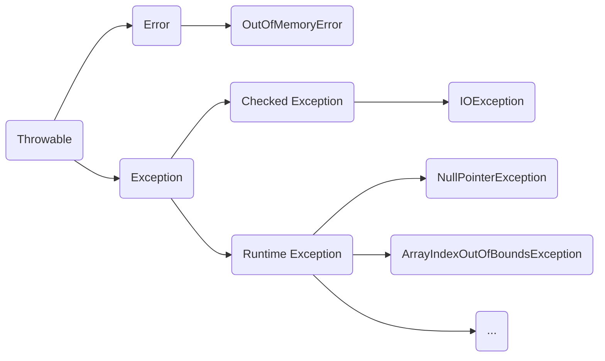

# 异常处理.md
Thursday, March 7th 2019, 22:49

<!-- @import "[TOC]" {cmd="toc" depthFrom=1 depthTo=6 orderedList=false} -->
<!-- code_chunk_output -->

* [异常处理.md](#异常处理md)
* [Error](#error)
* [Exception](#exception)
* [异常处理的两个基本原则](#异常处理的两个基本原则)
	* [应该捕获特定异常, 而不是Exception](#应该捕获特定异常-而不是exception)
	* [不要生吞异常](#不要生吞异常)
* [throw early, catch late原则](#throw-early-catch-late原则)

<!-- /code_chunk_output -->

FYI :point_right: [Exception和Error有什么区别？](https://time.geekbang.org/column/article/0?cid=82)

`Error`和`Exception`都继承自`Throwable`类, Java中只有`Throwable`类的实例才能被抛出或被捕获.

# Error

指程序运行时不大可能出现的情况, 但一出现就可能导致程序出现不可恢复的情况. 因此也不需要被捕获. i.e. OOM

# Exception

指程序正常运行的情况下, 可能出现的可以预料的意外情况, 可以并且需要被捕获并进行相应处理. i.e. NPE



# 异常处理的两个基本原则

```java
try {
  // 业务代码
  // …
  Thread.sleep(1000L);
} catch (Exception e) {
  e.printStackTrace();
}
```

## 应该捕获特定异常, 而不是Exception

改为: `catch(InterruptedException ie)`

## 不要生吞异常

尽量不要使用`e.printStackTrace();`, 这样在大型项目或分布式项目中会导致异常的堆栈信息很难被找到, 不利于开发调试. 使用日志系统.

# throw early, catch late原则

```java
public void readPreferences(String fileName){
	 //...perform operations...
	InputStream in = new FileInputStream(fileName);
	 //...read the preferences file...
}
```

以上, 如果fileName是null, 那么就会抛出NPE, 因此, 要在第一时间进行抛出 throw early:

```java
public void readPreferences(String fileName){
    Objects.requireNonNull(fileName);
	 //...perform operations...
	InputStream in = new FileInputStream(fileName);
	 //...read the preferences file...
}
```

至于"catch late", 其实是我们经常苦恼的问题, 捕获异常后, 需要怎么处理呢? 最差的处理方式, 就是我前面提到的"生吞异常", 本质上其实是掩盖问题. 如果实在不知道如何处理, 可以选择保留原有异常的cause信息, 直接再抛出或者构建新的异常抛出去. 在更高层面, 因为有了清晰的(业务)逻辑, 往往会更清楚合适的处理方式是什么.

`try-catch`代码块会产生额外的性能开销, 会影响JVM对代码进行优化, 因此尽量只包裹需要捕获异常的语句.

Java每实例化一个Exception, 都会对当前的栈进行快照, 也是一个比较耗费资源的操作.

NoClassDefFoundError是一个错误, 而ClassNotFoundException是一个异常, 对于Error和Exception的处理是不同的: 我们可以从异常中恢复程序但却不应该尝试从错误中恢复程序.

ClassNotFoundException产生的原因在于, Java中可以利用发射来动态的加载类, 但是在加载过程中, 如果指定的类路径下未找到需要的类, 此时就会报ClassNotFoundException.

NoClassDefFoundError产生的原因在于, JVM或者ClassLoader实例尝试加载类的时候却未找到该类的定义, 即要查找的类在编译时存在, 在运行时不存在时就会导致NoClassDefFoundError.

按照我们程序员的惯性认知: 当遇到return语句的时候, 执行函数会立刻返回. 但是, 在Java语言中, 如果存在finally就会有例外. 除了return语句, try代码块中的break或continue语句也可能使控制权进入finally代码块.

请勿在try代码块中调用return, break或continue语句. 万一无法避免, 一定要确保finally的存在不会改变函数的返回值.

 函数返回值有两种类型: 值类型与对象引用. 对于对象引用, 要特别小心, 如果在finally代码块中对函数返回的对象成员属性进行了修改, 即使不在finally块中显式调用return语句, 这个修改也会作用于返回值上.
