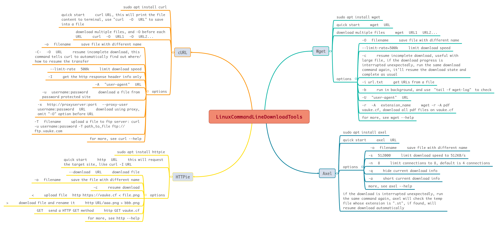

# Commands
Monday, April 22nd 2019, 17:19

<!-- @import "[TOC]" {cmd="toc" depthFrom=1 depthTo=6 orderedList=false} -->
<!-- code_chunk_output -->

* [Commands](#commands)
	* [service](#service)
	* [systemctl](#systemctl)
	* [Command Line Download Tools](#command-line-download-tools)

<!-- /code_chunk_output -->

## service

[service.md](./commands/service.md)

## systemctl

[systemctl.md](./commands/systemctl.md)

## Command Line Download Tools

[xmind file](./assets/LinuxCommandLineDownloadTools.xmind)

