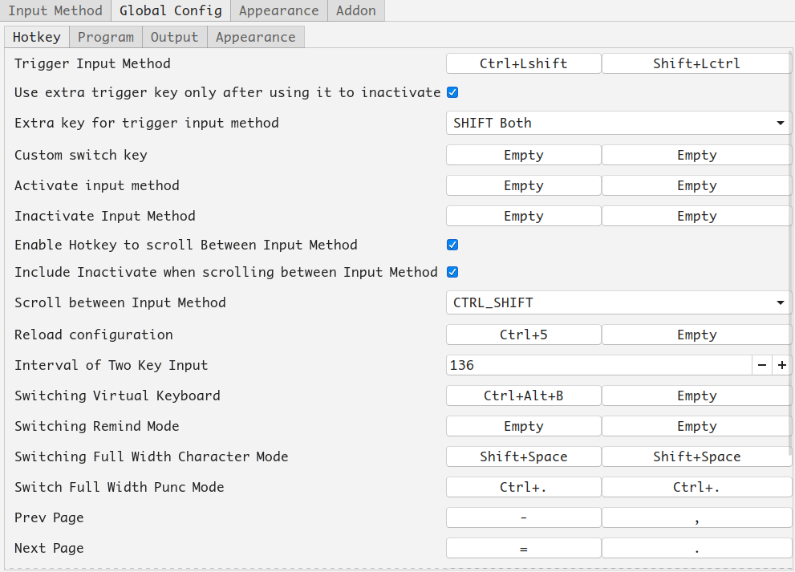

# Ubuntu.md
Monday, August 13th 2018, 23:26

## 安装gnome-tweak-tool
```shell
sudo apt install gnome-tweak-tool

sudo apt-get install chrome-gnome-shell
```

https://extensions.gnome.org</br>

| header 1 | header 2 |
| :---: | :---: |
| Caffeine | by eon |
| Clipboard Indicator | by Tudmotu |
| Coverflow Alt-Tab | by p91paul |
| Dynamic Top Bar | by AMDG |
| OpenWeather | by jens |
| Sound Input & Output Device Chooser | by kgshank |
| Top Panel Workspace Scroll | by gfxmonk |
| TopIcons Plus | by phocean |
| User Themes | by fmuellner |
| Workspace Indicator | by fmuellner |
| system-monitor | by Cerin |

安装system-monitor需要额外安装以下依赖:
```shell
sudo apt-get install gir1.2-gtop-2.0 gir1.2-networkmanager-1.0  gir1.2-clutter-1.0
```

## 搜狗输入法
```shell
sudo apt install fcitx
// sudo apt install fcitx-bin fcitx-table
reboot
```
install sogou input method
reboot



## 安装plank
```shell
sudo add-apt-repository ppa:docky-core/stable
sudo apt-get update
sudo apt-get install plank
```
软件中心搜索下载plank preferences
reboot

```shell
sudo update-alternatives --config default.plymouth
sudo update-initramfs -u
reboot

sudo apt purge plymouth-theme-ubuntu-budgie-logo
sudo apt purge plymouth-theme-ubuntu-budgie-text
sudo update-initramfs -u
reboot
```
## 修改grub等待时间
```shell
sudo vi /etc/default/grub
sudo update-grub
```

## albert
https://albertlauncher.github.io/ </br>
https://software.opensuse.org/download.html?project=home:manuelschneid3r&package=albert </br>
```shell
wget -nv https://download.opensuse.org/repositories/home:manuelschneid3r/xUbuntu_18.04/Release.key -O Release.key
sudo apt-key add - < Release.key
sudo apt-get update

sudo sh -c "echo 'deb http://download.opensuse.org/repositories/home:/manuelschneid3r/xUbuntu_18.04/ /' > /etc/apt/sources.list.d/home:manuelschneid3r.list"
sudo apt-get update
sudo apt-get install albert
```

## diskmount

## git
安装zsh前安装
```shell
sudo apt install git
```

## git proxy
git config --global https.proxy http://127.0.0.1:1080
git config --global https.proxy https://127.0.0.1:1080

//取消代理
git config --global --unset http.proxy
git config --global --unset https.proxy

git config --global http.proxy 'socks5://127.0.0.1:1080'
git config --global https.proxy 'socks5://127.0.0.1:1080'

git config --global user.name "username"
git config --global user.email "email"

## zsh
https://ohmyz.sh/
```shell
sudo apt-get install zsh

chsh -s $(which zsh)
sudo su
chsh -s $(which zsh)
logout

sh -c "$(wget https://raw.github.com/robbyrussell/oh-my-zsh/master/tools/install.sh -O -)"
```

## aria2
安装apt-fast前先安装aria2, 不然安装apt-fast时安装的aria2会导致uget不能使用aria2?(在uget中修改aria2c的路径为`whereis aria2c`获取到的, 可以解决)
```shell
sudo apt install aria2

mkdir /home/vauke/.aria2
cd .aria2
touch aria2.session
chmod 777 aria2.session
```
//指定aria2配置文件
--conf-path=/home/vauke/.aria2/aria2.conf

## apt-fast
```shell
sudo add-apt-repository ppa:apt-fast/stable
sudo apt update
sudo apt install apt-fast
```

## java
```shell
sudo vi /etc/profile

export JAVA_HOME=/home/vauke/jdk/jdk1.8.0_162
export JRE_HOME=${JAVA_HOME}/jre
export CLASSPATH=.:${JAVA_HOME}/lib:${JRE_HOME}/lib:$CLASSPATH
export PATH=${JAVA_HOME}/bin:${JRE_HOME}/bin:$PATH

reboot or source /etc/profile
```

## trim

## zeal
```shell
sudo add-apt-repository ppa:zeal-developers/ppa
sudo apt-get update
sudo apt-get install zeal
```

## shutter
设置快捷键`ctrl-shift-A`, `shutter -s`
```shell
sudo add-apt-repository ppa:shutter/ppa
sudo apt-get update
sudo apt-get install shutter
```

## calibre
```shell
sudo -v && wget -nv -O- https://download.calibre-ebook.com/linux-installer.sh | sudo sh /dev/stdin
```

## axel
```shell
sudo apt install axel
```

## uget
https://github.com/ugetdm/uget-integrator
```shell
sudo add-apt-repository ppa:uget-team/ppa
sudo apt update
sudo apt install uget-integrator
```

## vim
#### vundle
git clone https://github.com/VundleVim/Vundle.vim.git ~/.vim/bundle/Vundle.vim
sudo apt-get install fonts-powerline

#### powerline font https://powerline.readthedocs.io/en/latest/installation/linux.html#fonts-installation
wget https://github.com/powerline/powerline/raw/develop/font/PowerlineSymbols.otf
wget https://github.com/powerline/powerline/raw/develop/font/10-powerline-symbols.conf

## 取消错误通知
```shell
sudo vi /etc/default/apport
enabled=0
```

## vlc
sudo apt install vlc

## y-ppa-manager
sudo add-apt-repository ppa:webupd8team/y-ppa-manager
sudo apt update
sudo apt install y-ppa-manager

## meld
sudo apt install meld

## jad
http://jd.benow.ca/

## GoldenDict
在软件中心下载安装

## Font
```shell
sudo apt install ttf-mscorefonts-installer
sudo fc-cache -f -v
```

## MySQL
```shell
sudo apt install mysql-server

mysql -u root -p
```
```sql
show variables like 'char%';
show engines;

create user 'vauke'@'localhost' identified by '123456';
grant all privileges on *.* to 'vauke'@'localhost';
flush privileges;
show grants;
```

## Terminal
sudo apt install tilda

## atom plugins
https://momentjs.com/docs/#/displaying/


## ufw
```shell
sudo apt install ufw

sudo ufw enable
sudo ufw allow tcp //protoc
sudo ufw status
```

## ssh
```shell
ps -e | grep sshd
sudo apt install openssh-server
```

## nvidia
https://linuxconfig.org/how-to-install-the-nvidia-drivers-on-ubuntu-18-04-bionic-beaver-linux
```shell
ubuntu-drivers devices

//stable
sudo  apt install nvidia-driver-390 // nvidia-settings nvidia-prime
reboot

//beta
sudo add-apt-repository ppa:graphics-drivers/ppa
sudo apt update

ubuntu-drivers devices
sudo apt install nvidia-driver-396
```

切换显卡
```shell
prime-select query
prime-select intel //intel
prime-select nvidia //nvidia
```

解决画面撕裂:
http://forum.ubuntu.org.cn/viewtopic.php?t=487744
[截图](assets/解决画面撕裂.png)
```shell
sudo vi /etc/modprobe.d/nvidia-graphics-drivers.conf

添加:
options nvidia_drm modeset=1

:wq
sudo update-initramfs -u
reboot
```

## neofetch
```shell
// sudo apt insatll screenfetch
sudo apt install neofetchneofetch
```

## vm
安装vbox要额外装extension pack才能用u盘
粘贴拖拽功能不如vmware, 不能粘贴时在guest中调出任务管理器重启VboxGuestAddtions

vmware启动慢, 功能更完善稳定
