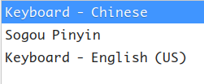
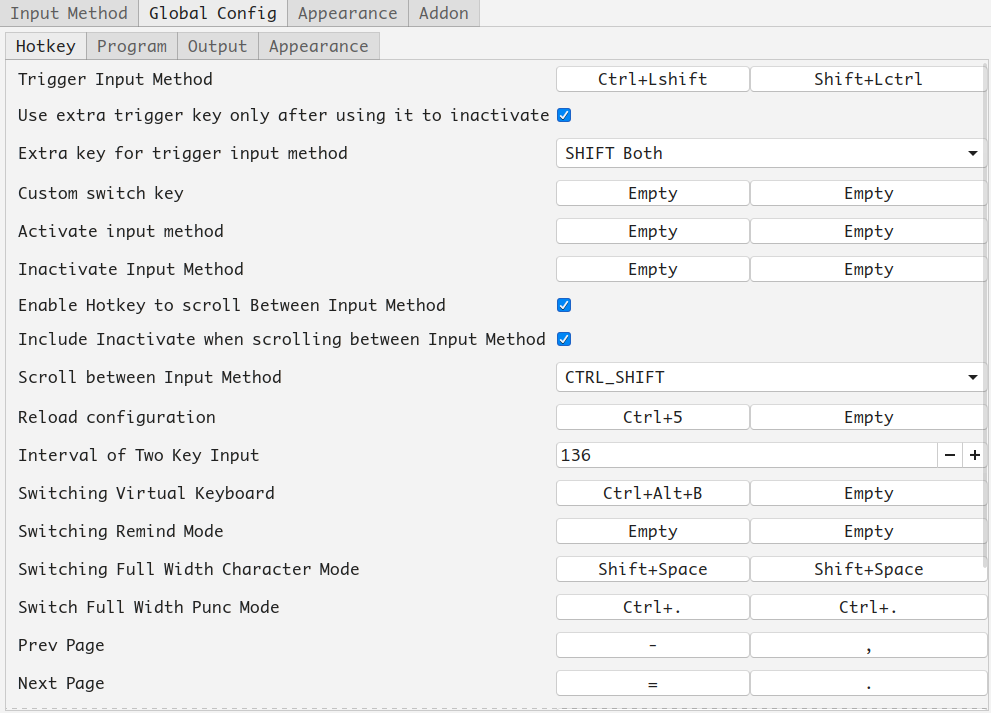
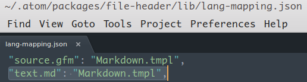
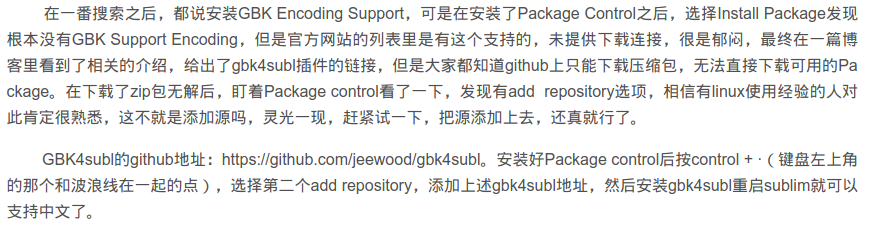
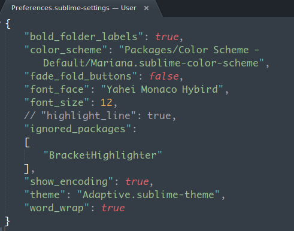

# UbuntuInstallationGuide.md
Monday, August 13th 2018, 23:26

<!-- @import "[TOC]" {cmd="toc" depthFrom=1 depthTo=6 orderedList=false} -->
<!-- code_chunk_output -->

- [ UbuntuInstallationGuide.md](#ubuntuinstallationguidemd)
  - [ 安装gnome-tweak-tool](#安装gnome-tweak-tool)
  - [ chrome](#chrome)
  - [ 搜狗输入法](#搜狗输入法)
  - [ 安装plank](#安装plank)
  - [ 修改grub等待时间](#修改grub等待时间)
  - [ albert](#albert)
  - [ diskmount](#diskmount)
  - [ git](#git)
    - [ git proxy](#git-proxy)
  - [ zsh](#zsh)
  - [ aria2](#aria2)
  - [ apt-fast](#apt-fast)
  - [ java](#java)
  - [ trim](#trim)
  - [ password management](#password-management)
  - [ wine-qq wechat](#wine-qq-wechat)
  - [ zeal](#zeal)
  - [ shutter](#shutter)
  - [ calibre](#calibre)
  - [ axel](#axel)
  - [ uget](#uget)
  - [ vim](#vim)
  - [ 取消错误通知](#取消错误通知)
  - [ y-ppa-manager](#y-ppa-manager)
  - [ meld](#meld)
  - [ jad](#jad)
  - [ GoldenDict](#goldendict)
  - [ Font](#font)
  - [ MySQL](#mysql)
  - [ Terminal](#terminal)
  - [ atom plugins](#atom-plugins)
  - [ sublime](#sublime)
  - [ ufw](#ufw)
  - [ ssh](#ssh)
  - [ nvidia](#nvidia)
  - [ neofetch](#neofetch)
  - [ vm](#vm)
  - [ htop](#htop)
  - [ stacer](#stacer)
  - [ catfish](#catfish)
  - [ tree](#tree)
  - [ music](#music)
  - [ video](#video)
  - [ 打开不了设置中心](#打开不了设置中心)
  - [ 误删network-manager后无法联网](#误删network-manager后无法联网)
  - [ snap安装软件太慢](#snap安装软件太慢)
  - [ e-mail client](#e-mail-client)
  - [ all in one apps](#all-in-one-apps)
    - [ built custom ones with Nativefier](#built-custom-ones-with-nativefier)
  - [ syncthing](#syncthing)
  - [ redis](#redis)
  - [ nginx](#nginx)
  - [ node.js](#nodejs)
  - [ gitmoji](#gitmoji)
  - [ commitizen](#commitizen)
  - [ docker](#docker)
  - [ wireshark](#wireshark)
  - [ 博客图床](#博客图床)
  - [ man & most](#man-most)
- [ at](#at)

<!-- /code_chunk_output -->

## 安装gnome-tweak-tool

```shell
sudo apt install gnome-tweak-tool

sudo apt install chrome-gnome-shell
```

安装插件 <br/>
https://extensions.gnome.org </br>

|             extensions              |    author    |
|:-----------------------------------:|:------------:|
|              Caffeine               |    by eon    |
|         Clipboard Indicator         |  by Tudmotu  |
|          Coverflow Alt-Tab          |  by p91paul  |
|           Dynamic Top Bar           |   by AMDG    |
|             OpenWeather             |   by jens    |
| Sound Input & Output Device Chooser |  by kgshank  |
|     Top Panel Workspace Scroll      |  by gfxmonk  |
|            TopIcons Plus            |  by phocean  |
|             User Themes             | by fmuellner |
|         Workspace Indicator         | by fmuellner |
|           system-monitor            |   by Cerin   |


安装system-monitor需要额外安装以下依赖:
```shell
sudo apt-get install gir1.2-gtop-2.0 gir1.2-networkmanager-1.0  gir1.2-clutter-1.0
```

安装图标主题 <br/>
yosa-max <br/>
ultra-flat-icons

## chrome

安装simsun.ttf解决chrome中文字体发虚

## 搜狗输入法

```shell
sudo apt install fcitx
// sudo apt install fcitx-bin fcitx-table
reboot
```
install sogou input method <br/>
reboot <br/>
 <br/>


## 安装plank

```shell
sudo add-apt-repository ppa:docky-core/stable
sudo apt-get update
sudo apt-get install plank
```

软件中心搜索下载plank preferences
reboot

```shell
sudo update-alternatives --config default.plymouth
sudo update-initramfs -u
reboot

sudo apt purge plymouth-theme-ubuntu-budgie-logo
sudo apt purge plymouth-theme-ubuntu-budgie-text
sudo update-initramfs -u
reboot
```

## 修改grub等待时间

```shell
sudo vi /etc/default/grub
// 将GRUB_TIMEOUT修改为0.1
GRUB_TIMEOUT=0.1
:wq

sudo update-grub
```

## albert

https://albertlauncher.github.io/ </br>
https://software.opensuse.org/download.html?project=home:manuelschneid3r&package=albert

```shell
wget -nv https://download.opensuse.org/repositories/home:manuelschneid3r/xUbuntu_18.04/Release.key -O Release.key
sudo apt-key add - < Release.key
sudo apt-get update

sudo sh -c "echo 'deb http://download.opensuse.org/repositories/home:/manuelschneid3r/xUbuntu_18.04/ /' > /etc/apt/sources.list.d/home:manuelschneid3r.list"
sudo apt-get update
sudo apt-get install albert
```

## diskmount

[Ubuntu挂载ntfs硬盘.md](Ubuntu挂载ntfs硬盘.md)

修改/etc/fstab, 参考[fstab](fstab)

若是无写入权限, 先`umount`, 然后`sudo ntfsfix /dev/sdX`, 或者进入win10->控制面板->电源->盖子, 电源按钮->更改不可用设置->取消勾选快速启动

## git

安装zsh前安装

```shell
sudo apt install git
```

### git proxy

```shell
git config --global https.proxy http://127.0.0.1:1080 <br/>
git config --global https.proxy https://127.0.0.1:1080 <br/>

//取消代理 <br/>
git config --global --unset http.proxy <br/>
git config --global --unset https.proxy <br/>

git config --global http.proxy 'socks5://127.0.0.1:1080' <br/>
git config --global https.proxy 'socks5://127.0.0.1:1080' <br/>

git config --global user.name "username" <br/>
git config --global user.email "email" <br/>
```

## zsh

https://ohmyz.sh/

```shell
sudo apt-get install zsh

chsh -s $(which zsh)
sudo su
chsh -s $(which zsh)
logout

sh -c "$(wget https://raw.github.com/robbyrussell/oh-my-zsh/master/tools/install.sh -O -)"
```

修改`~/.zshrc` :point_right: [.zshrc](assets/.zshrc)

```script
alias rm="rm -i"

setopt no_nomatch
# setopt no_glob
setopt EXTENDED_GLOB

export http_proxy="http://127.0.0.1:1080"
export https_proxy="http://127.0.0.1:1080"
```

## aria2

安装apt-fast前先安装aria2, 不然安装apt-fast时安装的aria2会导致uget不能使用aria2?(在uget中修改aria2c的路径为`whereis aria2c`获取到的, 可以解决)

```shell
sudo apt install aria2

mkdir /home/vauke/.aria2
cd .aria2
touch aria2.session
chmod 777 aria2.session
```

//指定aria2配置文件 --conf-path=/home/vauke/.aria2/aria2.conf <br/>
[aria2.conf](aria2.conf)

## apt-fast

```shell
sudo add-apt-repository ppa:apt-fast/stable
sudo apt update
sudo apt install apt-fast
```

## java

```shell
sudo vi /etc/profile

export JAVA_HOME=/home/vauke/jdk/jdk1.8.0_162
export JRE_HOME=${JAVA_HOME}/jre
export CLASSPATH=.:${JAVA_HOME}/lib:${JRE_HOME}/lib:$CLASSPATH
export PATH=${JAVA_HOME}/bin:${JRE_HOME}/bin:$PATH

reboot or source /etc/profile
```

## trim

将脚本[trim](trim)放在/etc/cron.weekly/下

```shell
sudo chmod +x trim
```

## password management

keepassxc

```shell
sudo add-apt-repository ppa:phoerious/keepassxc
sudo apt-get update
sudo apt install keepassxc
```

bitwarden <br/>
https://bitwarden.com

## wine-qq wechat

https://www.lulinux.com/archives/1319

https://github.com/wszqkzqk/deepin-wine-ubuntu

https://github.com/askme765cs/Wine-QQ-TIM

## zeal

```shell
sudo add-apt-repository ppa:zeal-developers/ppa
sudo apt-get update
sudo apt-get install zeal
```

## shutter

设置快捷键
Settings -> Devices -> Keyboard 添加
`ctrl-win-A`, `shutter -s`

```shell
sudo add-apt-repository ppa:shutter/ppa
sudo apt-get update
sudo apt-get install shutter
```

[解决编辑选项不能用](https://www.linuxidc.com/Linux/2018-04/151911.htm)

## calibre

```shell
sudo -v && wget -nv -O- https://download.calibre-ebook.com/linux-installer.sh | sudo sh /dev/stdin
```

## axel

```shell
sudo apt install axel
```

## uget

https://github.com/ugetdm/uget-integrator

```shell
sudo add-apt-repository ppa:uget-team/ppa
sudo apt update
sudo apt install uget-integrator
```

## vim

:point_right: [vim.md](vim.md)

## 取消错误通知

```shell
sudo vi /etc/default/apport
enabled=0
```

## y-ppa-manager

```shell
sudo add-apt-repository ppa:webupd8team/y-ppa-manager
sudo apt update
sudo apt install y-ppa-manager
```

## meld

sudo apt install meld

## jad

http://jd.benow.ca/

类似: luyten

## GoldenDict

在软件中心下载安装

## Font

```shell
sudo apt install ttf-mscorefonts-installer
sudo fc-cache -f -v
```

## MySQL

```shell
sudo apt install mysql-server

#禁止启动
sudo systemctl disable mysql
#开机启动
sudo systemctl enable mysql

mysql -u root -p
```

```sql
show variables like 'char%';
show engines;

create user 'vauke'@'localhost' identified by '123456';
grant all privileges on *.* to 'vauke'@'localhost';
flush privileges;
show grants;
```

## Terminal

sudo apt install tilda

## atom plugins

|          plugin           |    author    |
| ------------------------- | ------------ |
|        file-header        |   guiguan    |
|        file-icons         |  file-icons  |
|     language-markdown     | burodepeper  |
| markdown-preview-enhanced |  shd101wyy   |
|   markdown-table-editor   |    susisu    |
|      markdown-writer      |   zhuochun   |
|          minimap          | atom-minimap |
|  platformio-ide-terminal  |  platformio  |
|         tool-bar          |     suda     |
| tool-bar-markdown-writer  |   zhuochun   |
|       vim-mode-plus       |     t9md     |
|   vim-mode-plus-ex-mode   |     t9md     |

file-header设置日期格式:https://momentjs.com/docs/#/displaying/

file-header插件设置文件映射



Edit->Snippets...
添加

```cson
'.text.md':
  '<sup>':
    'prefix':'sup'
    'body':'<sup>$1</sup>$2'
  '<sub>':
    'prefix':'sub'
    'body':'<sub>$1</sub>$2'
  '<mark>':
    'prefix':'mark'
    'body':'<mark>$1</mark>$2'
  '<center>':
    'prefix':'center'
    'body':'<center>$1</center>$2'
  '<br>':
    'prefix':'br'
    'body':'<br/>$1'
  '<hr>':
    'prefix':'hr'
    'body':'<hr/>$1'
```

## sublime

安装gbk支持: 先安装codecs33, 然后安装GBK4subl





## ufw

```shell
sudo apt install ufw

sudo ufw enable
sudo ufw allow tcp // protocol
sudo ufw allow 21 // port
sudo ufw status
```

## ssh

```shell
ps -e | grep sshd
sudo apt install openssh-server
```

## nvidia

https://linuxconfig.org/how-to-install-the-nvidia-drivers-on-ubuntu-18-04-bionic-beaver-linux

```shell
ubuntu-drivers devices

//stable
sudo  apt install nvidia-driver-390 // nvidia-settings nvidia-prime
reboot

//beta
sudo add-apt-repository ppa:graphics-drivers/ppa
sudo apt update

ubuntu-drivers devices
sudo apt install nvidia-driver-396
```

切换显卡

```shell
prime-select query
prime-select intel //intel
prime-select nvidia //nvidia
```

解决画面撕裂:

http://forum.ubuntu.org.cn/viewtopic.php?t=487744

[截图](assets/解决画面撕裂.png)

```shell
sudo vi /etc/modprobe.d/nvidia-graphics-drivers.conf

添加:
options nvidia_drm modeset=1

:wq
sudo update-initramfs -u
reboot
```

## neofetch

```shell
// sudo apt insatll screenfetch
sudo apt install neofetchneofetch
```

## vm

安装vbox要额外装extension pack才能用u盘

Settings->System->Motherboard->Enable I/O APIC

Settings->Storage->Controller:SATA->Use Host I/O Cache

Settings->Storage->xxx.vdi->Solid-State Drive

粘贴拖拽功能不如vmware, 不能粘贴时在guest中调出任务管理器重启VboxGuestAddtions

vmware启动慢, 功能更完善稳定

## htop

sudo apt install htop

## stacer

[Stacer系统优化监视器](https://github.com/oguzhaninan/Stacer)

```shell
sudo add-apt-repository ppa:oguzhaninan/stacer
sudo apt update
sudo apt install stacer
```

## catfish

文件搜索

## tree

sudo apt install tree

## music

[iease music](https://github.com/trazyn/ieaseMusic)

https://github.com/sunzongzheng/music

spotify snap

## video

```shell
sudo apt install vlc

sudo apt install mplayer //装smplayer前装mplayer或者mpv

sudo add-apt-repository ppa:rvm/smplayer
sudo apt-get update
sudo apt-get install smplayer smplayer-themes smplayer-skins
```

vlc简单设置:

打开所有设置:

解决播放视频卡顿: Input / Codecs-> Advanced->File Caching 改为1000以上

解决内存占用大: Playlist -> Automatically preparse items 取消勾选

Video -> General video settings -> Drop late frames 去掉勾选

Video -> Window properties -> Source Aspect ratio 改为16:9

简单设置页面:

Input / Codecs: Hardware-accelerated decoding 选择VA-API video decoder(使用Intel核显)或者VDPAU(需安装nvidia驱动)

Video: Display -> Output -> VDPAU output (codec选择VDPAU后才设置)

## 打开不了设置中心

```shell
sudo apt install gnome-control-center
```

## 误删network-manager后无法联网

修改`/etc/network/interfaces`, 备份原来内容:

```shell
# interfaces(5) file used by ifup(8) and ifdown(8)
auto lo
iface lo inet loopback
```

使用`ifconfig -a`查看到有线网口为`enp4s0f1`, 修改`/etc/network/interfaces`:

```shell
# interfaces(5) file used by ifup(8) and ifdown(8)
auto enp4s0f1
iface enp4s0f1 inet dhcp
```

`dhcp`会自动获取ip, 也可替换为`static`, 然后指定ip, netmask, gateway

然后连接到路由器上, 重启即可联网

```shell
sudo apt install gnome-control-center
```

上条命令会连带安装`network-manager-gnome`, 如果没有, 则手动安装

## snap安装软件太慢

```shell
# search the app you want to install with snap
snap search "app_name"

# download the app to local
snap download "app_name"

# add the assertion to the system, auth may be required
snap ack app_name.assert

# install the snap app, auth may be required
snap install app_name.snap

# uninstall the snap app
sudo snap remove app_name
```

## e-mail client

mailspring

https://github.com/Foundry376/Mailspring

thunderbird

## all in one apps

[Station](https://getstation.com/)

[Rambox](https://rambox.pro/#home)

### built custom ones with Nativefier

pack any web site into an electron app

[Nativefier](https://github.com/jiahaog/nativefier)

```shell
npm i nativefier -g

# help info
nativefier -h

# usage
nativefier <target_url> [-n <app_name>] [-i <path_to_icon>] [path_to_dest_dir]
```

## syncthing

```shell
# Add the release PGP keys:
curl -s https://syncthing.net/release-key.txt | sudo apt-key add -

# Add the "stable" channel to your APT sources:
echo "deb https://apt.syncthing.net/ syncthing stable" | sudo tee /etc/apt/sources.list.d/syncthing.list

# Update and install syncthing:
sudo apt update
sudo apt install syncthing
```

create desktop shortcut:

```shell
cd /usr/share/applications

rm syncthing-start.desktop
rm syncthing-ui.desktop
```

use [syncthing.desktop](assets/syncthing.desktop) instead

## redis

```shell
sudo apt install redis

# already starts with system boot
# stop/start
systemctl stop/start redis-server

# cli
redis-cli
```

## nginx

```shell
sudo apt install nginx

# already starts with system boot
# stop/start
systemctl stop/start nginx
```

## node.js

FYI :point_right: [ubuntu通过包管理器安装node](https://github.com/nodesource/distributions/blob/master/README.md)

```shell
curl -sL https://deb.nodesource.com/setup_10.x | sudo -E bash -
sudo apt-get install -y nodejs

# npm is installed alone with nodejs
npm -v
node -v

# init package.json
npm init
npm init -y # gengerate a default package.json

# install, use afterwards npm init
npm install xxx / npm i xxx

# install globally, root privileges required
npm i -g xxx

# uninstall
npm uninstall xxx
npm uninstall xxx -g # global

# list installed packages
npm list
npm list -g # global

# update outdated packages
npm update xxx
npm update -g # update all globally installed packages
```

## gitmoji

[gitmoji-cli](https://github.com/carloscuesta/gitmoji-cli)

add emojis while typing commit messages

```shell
# install with npm
npm i -g gitmoji-cli

gitmoji -h # for help info
gitmoji -s xxx # for emoji lint
gitmoji -s bug
```

## commitizen

make git commit messages

[commitizen](https://github.com/commitizen/cz-cli)

[commitizen安装](https://commitizen.github.io/cz-cli/)

[commit message规范](https://github.com/conventional-changelog/conventional-changelog/blob/v0.5.3/conventions/angular.md)

```shell
npm i -g commitizen

# install commitizen adapter
# 1
# only for current project using git
commitizen init cz-conventional-changelog --save-dev --save-exact

# 2
# for all projects using git
# install globally
npm i -g cz-conventional-changelog

# create a .czrc file in home directory, with path referring to the preferred, globally installed, commitizen adapter
echo '{ "path": "cz-conventional-changelog" }' > ~/.czrc

# usage
git-cz

# if the adapter installed globally
git-cz / git cz
```

## docker

教程 :point_right: [github docker教程](https://github.com/yeasy/docker_practice)

```shell
# 由于 apt 源使用 HTTPS 以确保软件下载过程中不被篡改。因此，我们首先需要添加使用 HTTPS 传输的软件包以及 CA 证书
sudo apt install apt-transport-https ca-certificates curl software-properties-common

# 为了确认所下载软件包的合法性，需要添加软件源的 GPG 密钥
# 官方源
curl -fsSL https://download.docker.com/linux/ubuntu/gpg | sudo apt-key add -

sudo add-apt-repository "deb [arch=amd64] https://download.docker.com/linux/ubuntu $(lsb_release -cs) stable"


# 鉴于国内网络问题，强烈建议使用国内源
# curl -fsSL https://mirrors.ustc.edu.cn/docker-ce/linux/ubuntu/gpg | sudo apt-key add -
# sudo add-apt-repository "deb [arch=amd64] https://mirrors.ustc.edu.cn/docker-ce/linux/ubuntu $(lsb_release -cs) stable"

# install
sudo apt install docker-ce
```

默认情况下，docker 命令会使用 Unix socket 与 Docker 引擎通讯。而只有 root 用户和 docker 组的用户才可以访问 Docker 引擎的 Unix socket。出于安全考虑，一般 Linux 系统上不会直接使用 root 用户。因此，更好地做法是将需要使用 docker 的用户加入 docker 用户组

```shell
sudo groupadd docker

sudo usermod -aG docker vauke
```

退出终端, 注销并重新登录, 测试是否正确安装

```shell
docker run hello-world

docker version
docker info

# disable start on boot
sudo systemctl disable docker
```

docker的默认镜像存储路径是`/var/lib/docker`, 当`/`分区容量不够时, 可以考虑使用软链接
或者修改`/etc/docker/daemon.json`或者修改`docker.service`文件, 修改文件只能二选一,
不然会冲突, 无法开启docker, 建议修改`daemon.json`

```json
{
    "data-root": "/home/vauke/docker",
    "storage-driver": "overlay2"
}
```

重启docker, 会自动创建目录和结构

使用`docker info`查看`Docker Root Dir`和`Storage Driver`, 会发现值已改变

## wireshark

```shell
# show package info
apt-cache madison wireshark
# or
apt-cache show wireshark

# install
sudo apt install wireshark

# 非root使用wireshark
sudo usermod -aG wireshark vauke

# 默认tcpdump只能root使用, wireshark无法用
sudo chgrp wireshark /usr/sbin/tcpdump
```

## 博客图床

用[PicGo](https://github.com/Molunerfinn/PicGo)上传

[使用GitHub做图床教程](https://mp.weixin.qq.com/s/hJq2bA7wv12vCmM7Rvfa9Q)

## man & most

```shell
# 安装most
sudo apt install most

# 修改.zshrc
# 为man添加颜色区分, 使用most
export PAGER=most
# 设置行宽
export MANWIDTH=80
```

# at

```shell
sudo apt install at

# 使用at作定时任务, 具体:
man at
```
