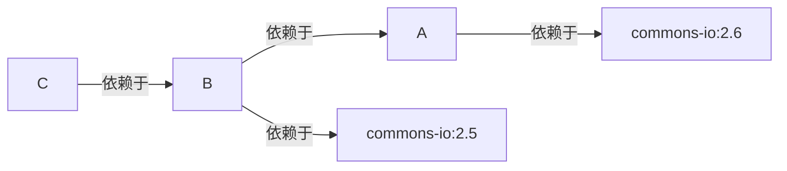
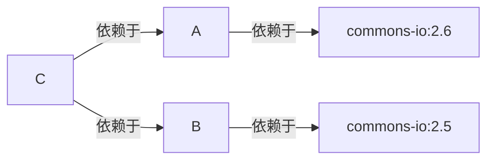

# readme.md
Tuesday, June 11th 2019, 14:29

<!-- @import "[TOC]" {cmd="toc" depthFrom=1 depthTo=6 orderedList=false} -->
<!-- code_chunk_output -->

* [readme.md](#readmemd)
* [常用构建命令](#常用构建命令)
* [使用archetype创建目录](#使用archetype创建目录)
* [maven生命周期](#maven生命周期)
* [pom.xml](#pomxml)
* [<scope>](#scope)
* [依赖冲突](#依赖冲突)

<!-- /code_chunk_output -->

# 常用构建命令

1. mvn compile
    - 编译项目
2. mvn test
    - 运行test包下的测试
3. mvn package
    - 打包项目为jar包
4. mvn clean
    - 删除项目路径下的target目录
5. mvn install
    - 安装jar包到本地仓库, 这样其他项目就可以在POM中添加其坐标来依赖

# 使用archetype创建目录

1. archetype:generate
    - 命令行交互的方式设置groupId, artifactId...
2. archetype:generate -DgroupId=... -DartifactId=... -Dversion=... -Dpackage=...

# maven生命周期

完整的项目构建过程: 清理, 编译, 测试, 打包, 集成测试, 验证, 部署

maven的生命周期基本对应了项目的完整的构建过程. maven的生命周期由插件进行具体的实现.

maven中定义了三套相互独立的生命周期, 每个生命周期又包含很多个阶段.

1. clean生命周期 用于清理项目
    - 包含3个阶段
        - pre-clean
        - clean
        - post-clean
2. default生命周期 用于构建项目
    - 常用的阶段
        - compile
        - test
        - package
        - install
    - 直接运行后面的阶段, 会依次执行前面的阶段
        - 如 运行 package 阶段时, 会先依次运行compile, test再执行package
3. site生命周期 用于生成项目的站点
    - 包含4个阶段
        - pre-site
        - site
        - post-site
        - site-deploy

# pom.xml

<details>
    <summary>pom.xml示例</summary>

```xml
<?xml version="1.0" encoding="UTF-8"?>
<project xmlns="http://maven.apache.org/POM/4.0.0"
         xmlns:xsi="http://www.w3.org/2001/XMLSchema-instance"
         xsi:schemaLocation="http://maven.apache.org/POM/4.0.0 http://maven.apache.org/xsd/maven-4.0.0.xsd">
    <modelVersion>4.0.0</modelVersion>

    <groupId>公司网址反写+项目名</groupId>
    <artifactId>项目名+模块名</artifactId>
    <!--
        x.y.z 大版本号.分支版本号.小版本号
        snapshot 快照
        alpha 内部测试
        beta 公测
        release 稳定
        GA 正式发布
    -->
    <version>版本号</version>
    <!--
        默认是jar, 还可以为zip, war, pom...
    -->
    <packaging>jar</packaging>
    <name>项目描述名</name>
    <url>项目地址</url>
    <description>项目描述</description>
    <developers>开发人员列表</developers>
    <licenses>证书信息</licenses>
    <organization>组织信息</organization>

    <!-- 在子模块的pom中定义要继承的父模块 -->
    <parent>
        <groupId></groupId>
        <artifactId></artifactId>
        <version></version>
        <relativePath></relativePath>
    </parent>

    <!-- 在父模块的pom中定义哪些模块是子模块 -->
    <modules>
        <module>子模块名</module>
    </modules>

    <properties>
        <project.build.sourceEncoding>UTF-8</project.build.sourceEncoding>
        <!-- 指定版本 -->
        <spring.version>5.0.2.RELEASE</spring.version>
    </properties>

    <!-- 依赖的管理, 一般用在父模块中来定义子模块共有的依赖, 子模块进行继承 -->
    <dependencyManagement>
        <dependencies>
            <dependency>
                <groupId></groupId>
                <artifactId></artifactId>
            </dependency>
        </dependencies>
    </dependencyManagement>

    <dependencies>
        <dependency>
            <groupId></groupId>
            <artifactId></artifactId>
            <version></version>
            <scope></scope>
            <type></type>
            <!-- true or false -->
            <optional></optional>
            <!-- 排除传递的依赖项 -->
            <exclusions>
                <exclusion>
                    <groupId></groupId>
                    <artifactId></artifactId>
                </exclusion>
            </exclusions>
        </dependency>
        <dependency>
            <groupId>org.springframework</groupId>
            <artifactId>spring-context</artifactId>
            <version>${spring.version}</version>
        </dependency>
    </dependencies>

    <build>
        <pluginManagement>
            <plugins>
                <plugin>

                </plugin>
            </plugins>
        </pluginManagement>

        <plugins>
            <plugin>
                <groupId></groupId>
                <artifactId></artifactId>
            </plugin>
        </plugins>
    </build>
</project>
```

</details>

# <scope>

maven中提供了3种classpath(编译, 测试, 运行)和6种scope, scope就是用来控制依赖的作用范围, 比如设置junit的scope为test时, 就是指只在测试时, 才将junit的依赖添加到运行环境中classpath

1. compile
    - 默认scope
    - 存在于项目的所有classpath中
2. provided
    - 只存在于编译和测试的classpath
    - 如果一个依赖在运行环境中存在时, 就可以使用这个scope, 方便在开发环境下进行项目的构建
        - 如 Tomcat这类的容器本身就有Servlet的API, 就可以将开发环境的Servlet的scope设为provided
3. runtime
    - 只存在于测试和运行的classpath中
    - 编译时不需要的依赖就可以设置为runtime
        - 比如MySQL的驱动, 在开发时是使用的各类驱动的接口, 并不需要具体的实现类, 因此MySQL的驱动设置为runtime
4. test
    - 只存在于测试的classpath
    - 只用于测试用途的依赖, 如junit就可以设置为test
5. system
    - 类似provided, 只是需要明确指定包含的jar
6. import
    - 只能在<dependencyManagement>中设置, 表示从其他的pom中导入依赖

# 依赖冲突

1. 自身pom中引入了相同依赖的不同版本, 这时候会自动引入后定义的依赖, 并不会产生冲突
2. 传递依赖中, 出现了相同依赖的不同版本时, 会首先根据路径长度进行选择, 短的优先; 如果路径长度相同, 则谁先声明谁优先.

短路径优先示例: 以下会自动使用commons-io的2.5版本



先声明优先示例: 对于以下的依赖传递关系, 如果C的pom文件中先声明依赖于A, 则实际使用的是commons-io:2.6, 如果是B则为commons-io:2.5


