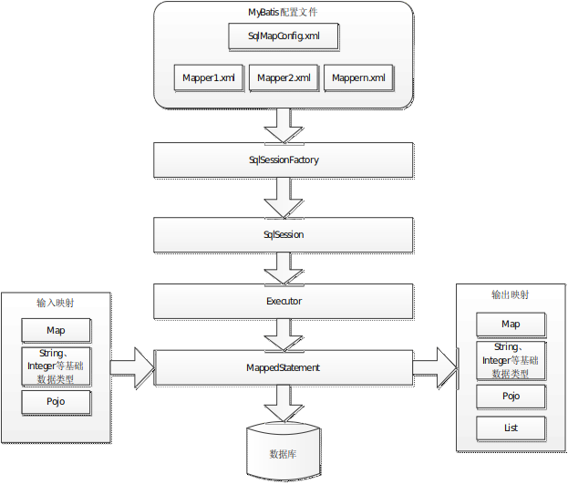

# readme.md
Thursday, June 27th 2019, 23:12

<!-- @import "[TOC]" {cmd="toc" depthFrom=1 depthTo=6 orderedList=false} -->
<!-- code_chunk_output -->

- [ readme.md](#readmemd)
- [ JDBC编程步骤](#jdbc编程步骤)
  - [ JDBC存在的问题](#jdbc存在的问题)
- [ MyBatis架构](#mybatis架构)

<!-- /code_chunk_output -->

# JDBC编程步骤

```java
public class JDBCDemo {
    private Connection connection;
    private PreparedStatement preparedStatement;
    private ResultSet resultSet;

    public void jdbc() {
        try {
            // 1. 加载驱动
            Class.forName("com.mysql.cj.jdbc.Driver");

            // 2. 创建Connection连接对象
            connection = DriverManager.getConnection(jdbcUrl, username, password);

            // 3. 创建PreparedStatement对象
            String sql = "select username, address from user where id = ?";
            preparedStatement = connection.prepareStatement(sql);
            preparedStatement.setInt(1, 5);

            // 4. 执行SQL语句, 获得ResultSet结果集
            resultSet = preparedStatement.executeQuery();

            // 5. 遍历ResultSet结果集, 封装查询结果
            User user;

            while (resultSet.next()) {
                user = new User();
                user.setUsername(resultSet.getString("username"));
                user.setAddress(resultSet.getString("address"));
            }
        } catch (Exception e) {
            e.printStackTrace();
        } finally {
            // 6. 释放连接和资源 ResultSet -> PrepareStatement -> Connection
            if (resultSet != null)
                resultSet.close();
            if (preparedStatement != null)
                preparedStatement.close();
            if (connection != null)
                connection.close();
        }
    }
}
```

## JDBC存在的问题

1. 数据库连接的创建和释放操作频繁, 容易造成系统资源的浪费, 并且创建和释放连接需要时间, 影响系统性能, 使用数据库连接池解决此问题.
2. SQL语句写在代码中不利于维护
3. ResultSet的解析封装不方便, 重复代码多

# MyBatis架构



1. SqlMapConfig.xml，此文件作为mybatis的全局配置文件，配置了mybatis的运行环境等信息。
mapper.xml文件即sql映射文件，文件中配置了操作数据库的sql语句。此文件需要在SqlMapConfig.xml中加载。
2. 通过mybatis环境等配置信息构造SqlSessionFactory
3. 由SqlSessionFactory会话工厂创建SqlSession即会话，操作数据库需要通过SqlSession进行。
4. mybatis底层自定义了Executor执行器接口操作数据库，Executor接口有两个实现，一个是基本执行器、一个是缓存执行器。
5. MappedStatement也是mybatis一个底层封装对象，它包装了mybatis配置信息及sql映射信息等。mapper.xml文件中一个sql对应一个MappedStatement对象，sql的id即是Mapped statement的id。
6. MappedStatement对sql执行输入参数进行定义，包括HashMap、基本类型、pojo，Executor通过MappedStatement在执行sql前将输入的java对象映射至sql中，输入参数映射就是jdbc编程中对preparedStatement设置参数。
7. MappedStatement对sql执行输出结果进行定义，包括HashMap、基本类型、pojo，Executor通过MappedStatement在执行sql后将输出结果映射至java对象中，输出结果映射过程相当于jdbc编程中对结果的解析处理过程。
