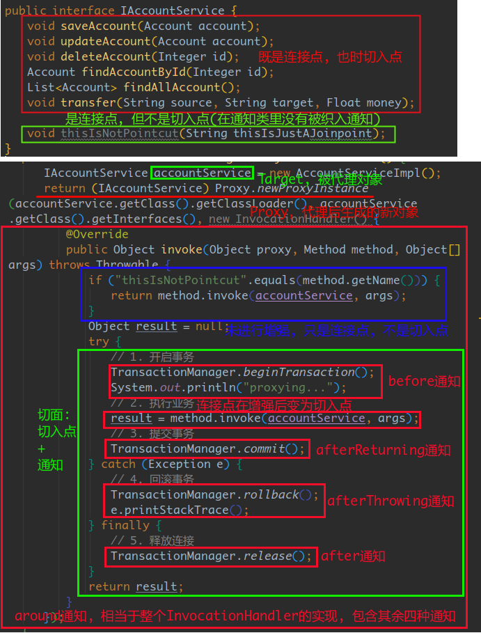

# Spring
Wednesday, May 22nd 2019, 09:40

<!-- @import "[TOC]" {cmd="toc" depthFrom=1 depthTo=6 orderedList=false} -->
<!-- code_chunk_output -->

* [Spring](#spring)
* [Intro](#intro)
	* [Overview](#overview)
	* [读取配置文件, 向IoC容器中注入java bean](#读取配置文件-向ioc容器中注入java-bean)
* [基于XML配置](#基于xml配置)
	* [bean创建的3种方式](#bean创建的3种方式)
	* [bean的作用范围](#bean的作用范围)
	* [bean的生命周期](#bean的生命周期)
	* [bean的依赖注入的3种方式](#bean的依赖注入的3种方式)
		* [集合类型的依赖注入](#集合类型的依赖注入)
	* [节点](#节点)
		* [bean节点](#bean节点)
		* [bean的内部节点](#bean的内部节点)
			* [constructor-arg 用于通过构造器注入依赖](#constructor-arg-用于通过构造器注入依赖)
			* [property 用于通过setter方法注入依赖](#property-用于通过setter方法注入依赖)
* [基于Annotation](#基于annotation)
	* [bean创建](#bean创建)
	* [依赖注入](#依赖注入)
		* [注入容器中的其他bean类型](#注入容器中的其他bean类型)
		* [注入String和基本类型](#注入string和基本类型)
		* [完全使用注解](#完全使用注解)
	* [bean的作用范围](#bean的作用范围-1)
	* [bean的生命周期](#bean的生命周期-1)
* [AOP](#aop)
	* [动态代理](#动态代理)
	* [AOP相关术语](#aop相关术语)
	* [AOP配置](#aop配置)
		* [基于XML](#基于xml)
		* [基于Annotation](#基于annotation-1)
* [Spring中的事务](#spring中的事务)
	* [事务](#事务)
	* [使用Spring提供的事务管理](#使用spring提供的事务管理)
	* [基于XML配置](#基于xml配置-1)

<!-- /code_chunk_output -->

# Intro

## Overview


方便解耦, 简化开发

## 读取配置文件, 向IoC容器中注入java bean

- ApplicationContext
    - 间接继承自BeanFactory接口
    - 在读取完配置文件后就立即加载scope为singleton的类, 并初始化加入容器
    - 因此, 单例对象时使用ApplicationContext创建, Spring会自动选择
    - 实现类
        - ClassPathXmlApplicationContext
            - 常用
            - 读取类路径下的配置文件, IDEA中是resources目录下
        - FileSystemXmlApplicationContext
            - 读取系统路径下的配置文件
		- XmlWebApplicationContext
			- 读取WEB-INF目录下的配置文件
- BeanFactory
    - Spring IoC容器的顶层接口
    - 读取配置文件后, 延迟加载对象 即使用bean时才会创建该bean
    - prototype时, 使用BeanFactory创建bean, Spring自动选择

example:

```java
/* 使用BeanFactory */
// 读取配置文件
Resource resource = new ClassPathResource("bean.xml");
BeanFactory beanFactory = new XmlBeanFactory(resource);

// 从容器中取出bean
UserService userService = beanFactory.getBean("userService", UserService.class);

/* 使用ApplicationContext */
// 读取配置文件
AbstractApplicationContext applicationContext = new ClassPathXmlApplicationContext("bean.xml");

// 从容器中取出bean
// UserService userService = (UserService) applicationContext.getBean("userService");
UserService userService = applicationContext.getBean("userService", UserService.class);
```

# 基于XML配置

[XML配置完整示例](./assets/bean.xml)

## bean创建的3种方式

1. 通过构造创建
    - 通过默认构造
        - 不指定`constructor-arg`子节点时(默认时), 要求实体类必须有默认构造, 否则创建失败, 抛出异常`BeanCreationException`...
    - 通过含参构造
        - 配置`constructor-arg`子节点
2. 通过静态工厂创建
    - 工厂提供一个可创建并返回所需bean的静态方法
3. 通过实例工厂创建
    - 工厂提供一个可创建并返回所需bean的方法

## bean的作用范围

使用scope属性指定

1. singleton
    - 单例, 默认
    - 单例对象在读取配置文件后就被创建
    - 创建时会执行init-method指定的方法, 销毁时会执行destroy-method指定的方法, 整个生命周期都由IoC容器控制
2. prototype
    - 多例
    - 对象并不会在读取文件时被创建, 而是在使用时才被创建
    - 创建时会执行init-method指定的方法, 而销毁时不会
    - 具体表现为关闭容器时, 不会像singleton对象一样调用init-destroy方法, 实例的销毁需要手动进行
3. request
    - 仅适用于Web环境中
	- 每个HTTP请求到来都会创建一个bean, 这个bean伴随该请求的整个生命周期
4. session
	- 仅适用于Web环境中
    - 一个存在于session生命周期中的bean
5. global-session
	- deprecated since Spring 5.0
	- 仅适用于Web环境中
    - 应用在Portlet环境下, 如果没有Portlet环境就相当于session
6. application
	- as of Spring 5.0
	- 仅适用于Web环境中
	- 一个存在于整个ServletContext生命周期中的bean
7. websocket
	- as of Spring 5.0
	- 仅适用于Web环境中
	- 一个存在于WebSocket生命周期中的bean

## bean的生命周期

1. 单例对象的生命周期
    - 出生
        - 容器创建时, 读取配置文件后就生成
    - 活着
        - 只要容器未被销毁就一直存在
    - 死亡
        - 容器被销毁时, 对象销毁
2. 多例对象的生命周期
    - 出生
        - 使用时容器才会创建该bean
    - 活着
        - 只要对象在使用, 就一直存活
    - 死亡
        - 当对象没有被引用并且长时间未被使用时, Spring会将其交由GC回收

## bean的依赖注入的3种方式

1. 构造注入
    - 实体类中必须要有相应的构造函数
    - 在bean节点中使用constructor-arg节点逐个指定构造的入参
2. setter注入
    - 根据setXxx(..)方法注入
    - 配置时值为xxx(Xxx的第一个字母改为小写)
3. p名称空间注入
    - 本质也是利用setter注入, 写法上简化
    - 导入p名称空间
    - p:xxx
        - xxx为setter的Xxx小写首字母
        - 基本类型属性和String
    - p:xxx-ref
        - 容器中的其他bean类型的属性

### 集合类型的依赖注入

1. 数组
	```
	<array>
		<value>xxx</value>
		...
	</array>
	```
2. List
	```
	<list>
		<value>xxx</value>
		...
	</list>
	```
3. Set
	```
	<set>
		<value>xxx</value>
		...
	</set>
	```
4. Map
	```
	<map>
		<entry key="xxx" value="xxx" />
		<entry key="xxx">
		    <value>xxx</value>
		</entry>
		...
	</map>
	```
5. Properties
	```
	<props>
		<prop key="xxx">xxx</prop>
		...
	</props>
	```

## 节点

### bean节点

用于向上图所示的Core Container中加入java bean并由其对java bean进行生命周期的管理

- bean节点属性
    - id
        - java bean的唯一标识
    - class
        - 要创建的对象的全限定类名
			- com.vauke.spring.service.UserServiceImpl
    - factory-bean
        - 使用实例工厂方法创建bean时使用. 使用静态工厂时不需要此属性, 直接通过class属性指定静态工厂类的全限定类名
        - 指定工厂bean对象
    - factory-method
        - 实例或静态工厂创建bean时, 用于指定要使用的工厂方法
    - parent
        - 将某个bean节点的配置当作模板来引用
        - 当前bean节点会使用parent指定的bean的所有配置
        - 可与abstract结合使用
    - abstract
        - 当前bean不会实例化, 可在配置很多具有相同特点(同个类, 同个属性...)的bean时, 用作模板
        - 当前bean节点有abstract属性时, 可以不指定class属性, 而仅仅用其来配置公共属性的值
    - init-method
        - 用于指定实体类中的某个方法作为初始化方法, 在容器创建bean时调用
    - destroy-method
        - 同init-method, 用于在容器关闭, bean销毁时调用
        - prototype不涉及此方法
    -

### bean的内部节点

#### constructor-arg 用于通过构造器注入依赖

- 属性
    - name
        - 指定构造的入参名为其赋值
    - type
        - 指定参数的类型为其赋值
        - 当有两个及以上参数类型相同时, 不适用, 因此一般不用
    - index
        - 指定构造中该参数的位置为该位置的参数赋值
    - 上述用于指定参数的三个属性, 选一即可
    - value
        - 指定值
        - *基本类型和String*
    - ref
        - 指定值
        - *容器中的其他bean类型的属性*

#### property 用于通过setter方法注入依赖

可以和constructor-arg共同作用, 但*只有property时, 实体类必须有默认构造*, 才能成功创建bean对象

- 属性
    - name
        - 必须有对应的setter
        - 指定setter的入参名为其赋值
    - value
        - 指定值
        - 基本类型和String
    - ref
        - 指定值
        - 基本类型和String

# 基于Annotation

## bean创建

1. @Component
	- 相当于xml配置中的bean节点
	- 属性
		- value
			- 用于指定bean的id, 不指定时, 默认为当前类名首字母小写
2. @Repository
	- 同@Component, 一般用于指代持久层的bean
3. @Service
	- 一般用于指代服务层的bean
4. @Controller
	- 一般用于指代控制层的bean

`@Repository`, `@Service`, `@Controller`都和`@Component`作用相同, 但提供更明确的语义来指代不同层的bean

## 依赖注入

### 注入容器中的其他bean类型

1. @Autowired
	- 自动按*类型*注入, 只要容器中有*唯一*的类型匹配时, 就可以完成依赖的注入, 否则抛出异常
		- *当容器中有两个及以上的相同类型的bean时, 将按照bean的id来进行自动注入*
	- 可以省略该属性在该bean中的setter(即直接将这个注解加到属性的声明上)
	- 属性
		- required
			- 是否必须, 默认为true
2. @Qualifier
	- 须和@Autowired结合使用, 用于指定bean的id
	- 不能用于通过构造方法实现的注入方式, @Qualifier不能用在构造之上
3. @Resource
	- 直接通过bean的id进行注入
	- 属性
		- name
			- 用于指定bean的id
	- 不能用于通过构造方法实现的注入

### 注入String和基本类型

1. @Value
	- 属性
		- value
			- 指定要注入的属性, 支持SpEL

### 完全使用注解

上述配置中虽然使用到了注解来向容器中注入bean, 但仍需在xml配置中配置包扫描的路径, properties文件的路径以及数据源的配置等

1. @Configuration
	- 类注解, 用于指定Spring的配置类
	- *类的路径要包含在@ComponentScan中*
		- 因为@Configuration也是向容器中注入bean
2. @ComponentScan
	- 类注解, 用于替代xml配置中的`<context:component-scan base-package="xxx" />`
	- 属性
		- basePackages
			- 指定要扫描的包的路径
		- value 同 basePackages
3. @Bean
	- 用于方法之上, 将方法的返回值作为bean注入到容器中
	- 属性
		- name
			- 指定bean的id, 不指定时为方法名
		- value 同 name
		- autowire
			- 指定是按类型注入还是按名称注入
	- 若方法有参数列表, 则*自动根据参数类型到容器中进行匹配*, 若匹配到, 则自动注入, 否则报错
	- 若匹配到多个, 则使用`@Qualifier`指定
4. @Import
	- 用于在主配置类中指定从配置文件
	- 属性
		- value
			- 指定从配置文件的Class类的类型
5. @PropertySource
	- 类注解, 用于指定properties文件的路径

[注解配置类示例1](./assets/MainConfig.java)

[注解配置类示例2](./assets/JdbcConfig.java)

*完全使用注解后, 获取容器上下文的方式也改变*

```java
/** 使用xml时 */
AbstractApplicationContext applicationContext = new ClassPathXmlApplicationContext("bean.xml");

/** 使用注解配置类 */
AbstractApplicationContext applicationContext = new AnnotationConfigApplicationContext(MainConfig.class);
```

## bean的作用范围

1. @Scope
	- 改变bean的作用范围
	- 属性
		- value 指定bean的作用范围, 取值和xml中一致

## bean的生命周期

1. @PostConstruct
	- 指定bean的初始化方法, 和xml中的init-method一致
2. @PreDestroy
	- 指定bean的销毁方法, 和xml中的destroy-method一致

# AOP

## 动态代理

* 代理
	* 在不改变原有代码的基础上, 对代码进行增强
	* 静态代理
	* 动态代理
		* 在方法运行时, 动态地向执行过程注入代码, 丰富执行流程的代理方式
		* 分类
			* 基于接口
				* JDK提供的动态代理
				* 使用java.lang.reflect.Proxy类
				* *需要被代理类实现一个接口*
			* 基于类继承
				* CGLib jar包提供的动态代理
				* *需要被代理类可以被继承, 不能是final修饰*

#

<details>
    <summary>JDK动态代理, example:</summary>

```java
// 1. 获取要被代理的对象
ComputerFactory computerFactory = new ComputerFactory();
// 2. 获取加载被代理对象的ClassLoader
ClassLoader classLoader = computerFactory.getClass().getClassLoader();
// 3. 获取被代理对象实现的接口的Class类型的数组, 以下两种都可以
Class[] interfaces = new Class[]{IAgent.class};
Class[] interfaces2 = computerFactory.getClass().getInterfaces();
// 4. 调用被代理对象的方法, 添加用于增强被代理对象的方法
InvocationHandler invocationHandler = new InvocationHandler() {
    /**
     *  执行被代理对象的任何方法都会被拦截进入到此方法
     *
     *  Object proxy: 当前代理对象的引用, 在此方法中调用会引起死循环
     *  Method method: 被代理对象当前正在调用的方法的Method对象
     *  Object[] args: 正在调用的方法的参数
     *
     *  @return Object 和当前正在调用的方法的返回值类型一致
     */
    @Override
    public Object invoke(Object proxy, Method method, Object[] args) throws Throwable {
        /** 在这里添加要用于增强的方法 */
        // 1. 获取正在被调用的方法的参数
        Float money= (Float) args[0];

        // 2. 判断正在被调用的方法
        Object result = null;
        if("sale".equals(method.getName())) {
            /** 调用被代理对象正在调用的方法, 并获得执行结果 */
            if (money >= 1000)
                result = method.invoke(computerFactory, args);
            System.out.println("代理商可以在这里收取卖电脑的代理费20%");
        } else {
            result = method.invoke(computerFactory, args);
            System.out.println("代理商可以在这里收取售后服务的代理费10%");
        }

        /** 在这里添加要用于增强的方法 */
        System.out.println("方法已增强");

        return result;
    }
};

// 5. 获得被代理后的对象
IAgent proxiedFactory = (IAgent) Proxy.newProxyInstance(classLoader, interfaces2, invocationHandler);

// 6. 调用方法, 此时会调用handler中的invoke方法
proxiedFactory.sale(1000f);
```

</details>


<details>
    <summary>CGLib动态代理, example:</summary>

```java
// 1. 获取要被代理的对象
ComputerFactory computerFactory = new ComputerFactory();

// 2. 调用原方法添加用于增强被代理对象的方法
/** Callback接口相当于JDK代理中的InvocationHandler接口 */
Callback callback = new MethodInterceptor() {
    /**
     * Object obj: 当前正在代理的对象
     * Method method: 被代理对象当前正在调用的方法的Method对象
     * Object[] args: 被代理对象当前正在调用的方法的参数
     * MethodProxy proxy: 当前执行方法的代理对象
     */
    @Override
    public Object intercept(Object obj, Method method, Object[] args, MethodProxy proxy) throws Throwable {
        /** 在这里添加要用于增强的方法 */
        // 1. 获取正在被调用的方法的参数
        Float money= (Float) args[0];

        // 2. 判断正在被调用的方法
        Object result = null;
        if("sale".equals(method.getName())) {
            /** 调用被代理对象正在调用的方法, 并获得执行结果 */
            if (money > 1000)
                result = method.invoke(computerFactory, args);
            System.out.println("代理商可以在这里收取卖电脑的代理费20%");
        } else {
            result = method.invoke(computerFactory, args);
            System.out.println("代理商可以在这里收取售后服务的代理费10%");
        }

        /** 在这里添加要用于增强的方法 */
        System.out.println("方法已增强");

        return result;
    }
};

// 3. 获得被代理后的对象
ComputerFactory cglibProxiedFactory = (ComputerFactory) Enhancer.create(computerFactory.getClass(), callback);
// 4. 调用方法, 此时会调用interceptor中的intercept方法
cglibProxiedFactory.sale(1000f);
```

</details>

#

## AOP相关术语

1. Joinpoint连接点
	- 连接点是指被拦截到的方法, spring只支持方法类型的连接点
	- 被被代理类实现的接口中的所有方法都可以称为连接点(在被调用时都会被拦截)
2. Pointcut切入点
	- 切入点是指要对哪些连接点进行拦截的定义
	- 被代理类中被拦截后进行增强的方法称之为切入点
		- 不是所有的连接点都是切入点, 但所有的切点都是连接点
3. Advice通知
	- 通知是指将连接点拦截后要做的增强
	- 通知的类型
		1. before 前置通知
			- 方法执行前就会执行
		2. afterThrowing 异常通知 和 返回通知是互斥的, 只会有一个执行到
			- 方法执行出现异常后, 才会执行
			- 类似于catch语句块
		3. afterReturning 返回通知
			- 方法正常执行后才会执行
			- 类似于try语句块
		4. after 后置通知
			- 不管是否方法会抛出异常, 都会执行
			- 类似于finally语句块
		5. around 环绕通知
			- 包含了将通知织入切入点的整个过程, 可以包含其他所有通知
4. Introduction引介
	- 一种特殊的通知, 在不修改类代码的前提下, 引介可以在运行期为类动态地添加一些方法或Field
5. Target目标对象
	- 被代理的对象
6. Weaving织入
	- 将增强的代码应用到目标对象以创建出代理后的对象的过程
		- 将通知应用到连接点, 连接点变为切入点, 形成切面的过程
	- spring采用动态代理进行织入
	- AspectJ采用编译期织入和类加载期织入
7. Proxy代理
	- 一个类被AOP织入通知后, 就产生一个代理后的对象
		- 被代理后产生的新对象
8. Aspect切面
	- 切入点和通知的结合



## AOP配置

### 基于XML

[XML配置示例](./assets/bean-aop.xml)

[XML对应代码示例](./assets/Logger.java)

1. aop:config节点
	- 配置切面
	- 子节点
		- aop:pointcut 指定可以匹配到切入点的表达式
			- 在配置文件中的位置要在 `aop:aspect` 节点之前
			- 属性
				- id pointcut的名称
				- expression 切入点表达式
		- aop:aspect
			- 属性
				- id 指定切面的名称
				- ref 指定通知类的引用
			- 子节点
				- aop:before, aop:after-returing, aop:after-throwing, aop:after和aop:around
				- 共有属性
					- method 指定通知类中的方法
					- pointcut 指定可以匹配到切入点的表达式
					- pointcut-ref 指定 aop:pointcut 的引用
					- arg-names 通知类方法的参数
				- after-throwing特有
					- throwing
				- after-returning特有
					- *如果指定returning属性, 则切入点必须要有返回值, 返回通知才会被调用*
					- 如果不指定, 返回通知会在正常执行的情况下调用

> 环绕通知很特殊, 不仅因为它可以包含其他四中通知, 类似于整个InvocationHandler的实现(如上图), 更因为, 其他四种通知, 在方法调用的织入过程中, 只能大致知道该通知是在切入点之前还是之后执行的(比如前置在切入点执行之前执行, afterThrowing在切入点抛出异常之后才会执行...), 而环绕通知可以很明确的在代码的逻辑上就可以看出执行的顺序, 类似于上图的动态代理, 自定义程度很高.

### 基于Annotation

需要在配置文件中配置包扫描和添加`<aop:aspectj-autoproxy />`节点

完全不使用配置文件, 则需要定义一个配置类, 使用`@ComponentScan(basePackages="")`配置包扫描, 使用`@EnableAspectJAutoProxy`启用自动代理, 使用`@Component`将通知类注入容器, 使用`@Aspect`指定通知类是一个切面

[基于Annotation代码示例](./assets/Logger2.java)

# Spring中的事务

Spring中的事务是基于Spring AOP实现的

## 事务

> 多个原子操作要使用同一个Connection对象才能实现事务的控制, 一般使用ThreadLocal使Connection对象与当前线程进行绑定, 因此, 不同线程的Connection也不能一样

> 由于事务默认是设置为autocommit的, 因此要操作事务需要将事务设置为手动提交, 回滚...

<details>
    <summary>手动设置事务代码示例</summary>

```java
// 使用Spring transaction提供的方法将connection对象与线程进行绑定
TransactionSynchronizationManager.initSynchronization();

Connection connection = null;

try {
    // 获取与当前线程绑定的Connection对象
    connection = DataSourceUtils.getConnection(this.dataSource);
    // 设置事务为手动提交, 默认为自动提交
    connection.setAutoCommit(false);
    Account source = accountDao.findAccountByName(sourceName);
    Account target = accountDao.findAccountByName(targetName);
    source.setMoney(source.getMoney() - money);
    target.setMoney(target.getMoney() + money);
    accountDao.updateAccount(source);

    // 模拟业务异常
    int i = 1 / 0;

    accountDao.updateAccount(target);
    // 提交事务
    connection.commit();
} catch (Exception e) {
    e.printStackTrace();
    // 回滚事务
    connection.rollback();
} finally {
    if (connection != null) {
        // 关闭连接
        connection.close();
    }
}
```

</details>

## 使用Spring提供的事务管理

和上面示例代码一样, 只是Spring自动进行了设置. 其本质也是将connection对象和线程进行绑定, 使得同一线程中的所有操作都是用同一个connection对象, 这是事务控制的基础. 然后关闭事务的自动提交, 改为手动提交, 回滚...

## 基于XML配置

[事务配置示例.xml](./assets/事务配置示例.xml)

1. tx:advice
	- 用于将事务管理器作为通知类
	- 属性
		- id 指定名称
		- transaction-manager 指定TransactionManger的bean
	- tx:attributes 配置切入点信息
		- tx:method 指定切入点
			- 属性
				- name 用于匹配方法, * 表示匹配所有方法
				- isolation 指定事务的隔离级别, 默认为 DEFAULT 表示使用数据库的隔离级别
				- read-only 是否为只读事务, 默认为 false, 只有查询时才需要设置为 只读
				- timeout 指定事务的过期时间, 默认为 -1 不过期, 单位 秒
				- propagation 指定事务的传播行为
					- REQUIRED 默认, 如果外层方法有事务时, 内层方法和外层使用同一事务, 外层没有时, 内层就新建一个事物, 可用于增删改
					- SUPPORTS 外层有就用外层, 没有就不用事务, 一般用于查询
					- REQUIRES_NEW 不管外层有没有事务, 内层都新建一个事务
				- rollback-for 用于指定一个异常, 当产生该异常时, 事务回滚
				- no-rollback-for 用于指定一个异常, 当产生该异常时, 事务不回滚
2. aop:config
	- aop:pointcut 指定用于匹配切点的表达式
	- aop:advisor
		- advice-ref 指定通知的引用, 这里要只想TransactionManager的引用, 即 tx:advice的id
