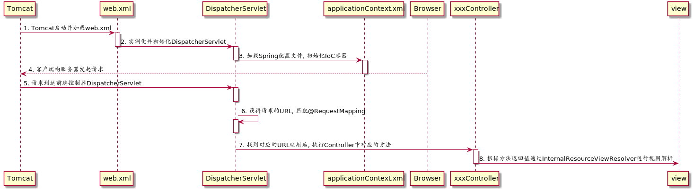

# readme.md
Monday, June 3rd 2019, 22:54

<!-- @import "[TOC]" {cmd="toc" depthFrom=1 depthTo=6 orderedList=false} -->
<!-- code_chunk_output -->

* [readme.md](#readmemd)
* [Intro](#intro)
	* [SpringMVC的优势](#springmvc的优势)
	* [JavaEE的三层架构与MVC的关系](#javaee的三层架构与mvc的关系)
		* [MVC模型](#mvc模型)
	* [SpringMVC处理流程](#springmvc处理流程)
* [注解](#注解)

<!-- /code_chunk_output -->

# Intro

> SpringMVC是一种基于Java实现MVC设计模型的请求驱动类型的轻量级Web框架, 已经融合在Spring Web FLow中. 它通过一套注解, *让一个简单的Java类成为处理请求的控制器, 而无需实现任何接口*, 同时它还支持RESTful风格的请求.

## SpringMVC的优势

1. 清晰的角色划分
    - 前端控制器 DispatcherServlet
    - 请求到处理器映射 HandlerMapping
    - 处理器适配器 HandlerAdapter
    - 视图解析器 ViewResolver
    - 页面控制器 Controller
    - 验证器 Validator
    - 命令对象 Command 请求参数绑定到的对象就是命令对象
    - 表单对象 Form Object
2. 分工明确, 易于扩展
3. 命令对象就是一个POJO, 无需继承框架中的特定类

## JavaEE的三层架构与MVC的关系

1. 表现层 web
    - 负责接收客户端请求, 向客户端响应请求的结果
    - *MVC只是表现层的设计模型, 其他层没有关系*
    - 开发时依赖于业务层
2. 业务层 service
    - 负责业务逻辑处理
    - 可能会依赖于持久层
3. 持久层 dao
    - 负责数据的持久化

### MVC模型

1. Model 模型
    - 指数据模型, 一般情况下用于封装数据
2. View 视图
    - 指JSP或HTML页面, 用于展示数据
3. Controller 控制器
    - 用于处理程序逻辑

## SpringMVC处理流程

1. Tomcat启动, 读取web.xml中的配置
2. 由于web.xml中配置了DispatcherServlet并将其load-onstartup设置为1, url-pattern设置为/, 则在tomcat启动后就创建了DispatcherServlet对象
3. 根据配置的applicationContext.xml的位置读取文件, 初始化IoC容器, 创建bean
4. 客户端发起请求
5. 请求到达tomcat后被DispatcherServlet拦截
6. 此时, 根据URL匹配对应的controller
7. 若有对应controller且请求方法也匹配, ,就调用对应controller的方法
8. 根据ViewResolver的实现类InternalResourceViewResolver的配置找到对应的页面并显示

# 注解

1. @RequestMapping
    -
2.
